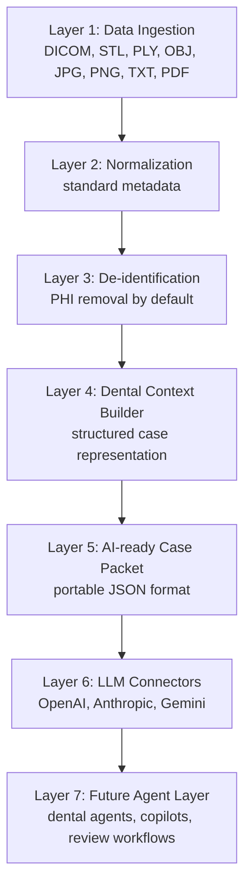

# ai-ready-dental-case-packet

Build a de-identified Dental Case Packet from local dental records.

This repository contains:

- A v0.1 Dental Case Packet specification.
- A local Python CLI that builds and validates packets.
- Runnable sample input and sample output.
- Tests and CI for the reference implementation.

The CLI reads files like clinical notes, treatment plans, DICOM folders, images, and scan files. It writes structured JSON, Markdown, file manifests, logs, and de-identified text copies.

It does **not** diagnose, recommend treatment, or claim clinical accuracy. Every output is for dentist review only.

## 30-Second Quickstart

```bash
git clone https://github.com/ClinicBrain-ai/ai-ready-dental-case-packet.git
cd ai-ready-dental-case-packet

python -m venv .venv
source .venv/bin/activate
pip install -e ".[dev]"

python -m dental_packet build --input ./examples/sample_input --output ./case_packet_output
python -m dental_packet validate --input ./case_packet_output/case_packet.json
```

Expected output:

```text
Built case packet: case_packet_output/case_packet.json
case_packet.json is valid
```

Generated files:

```text
case_packet_output/case_packet.json
case_packet_output/case_packet.md
case_packet_output/manifest.json
case_packet_output/files_index.json
case_packet_output/deidentified/
case_packet_output/logs/
```

## What This Is

This repository should be read like an infrastructure specification project:

- `spec/` contains normative specification artifacts.
- `rfcs/` contains design proposals and compatibility decisions.
- `examples/case_packets/` contains versioned example packets.
- `src/dental_packet/` is a reference implementation, not the product itself.

For a more detailed walkthrough, see [docs/quickstart.md](docs/quickstart.md).

## Design Principles

- Do not diagnose.
- Do not generate treatment recommendations.
- Do not claim clinical accuracy.
- Only transform data into structured context.
- Make every output suitable for dentist review.
- Use privacy-first architecture.
- De-identify by default.
- Keep the project open-source friendly.

Every AI-facing output must be treated as **for clinical review only**.

## Why Dentistry Needs An AI-Native Data Layer

Dental cases often arrive as scattered CBCT DICOM studies, panoramic X-rays, periapical X-rays, intraoral scans, photos, clinical notes, chief complaints, and treatment plans. LLM workflows work better when those records are organized into predictable references, normalized metadata, de-identified summaries, file indexes, and safety disclaimers.

This project creates the Dental Case Packet: a standardized context object that can be consumed by:

- GPT
- Claude
- Gemini
- OpenAI Agents
- dental copilots
- clinical review systems
- future dental foundation models

Think of the long-term direction as **DICOM + FHIR + LangChain for dentistry**.

## Repository Map

```text
.github/workflows/
  ci.yml
docs/
  quickstart.md
  architecture-review.md
  roadmap.md
  packet-spec.md
spec/
  dental-case-packet-v0.1.md
  dental-case-packet.schema.json
  validation-rules.md
  versioning.md
  compatibility.md
  fhir-interoperability.md
rfcs/
  0001-dental-case-packet-v0.1.md
  0002-privacy-first-packet-generation.md
  0003-fhir-interoperability-design.md
examples/
  case_packets/
    minimal-v0.1.json
    imaging-rich-v0.1.json
  sample_input/
  sample_output/
src/dental_packet/
  reference implementation CLI
```

## Reference Implementation

The Python package in `src/dental_packet/` is the v0.1 reference implementation for the Dental Case Packet Specification. It is intentionally local-first and deterministic.

### Install

```bash
python -m venv .venv
source .venv/bin/activate
pip install -e ".[dev]"
```

### CLI Usage

Build a packet:

```bash
python -m dental_packet build --input ./examples/sample_input --output ./case_packet_output
```

Validate a generated packet:

```bash
python -m dental_packet validate --input ./case_packet_output/case_packet.json
```

### Developer Checks

```bash
ruff check .
pytest
python -m dental_packet build --input ./examples/sample_input --output ./case_packet_output
python -m dental_packet validate --input ./case_packet_output/case_packet.json
```

## v0.1 Release Checklist

- [x] Install works with `pip install -e ".[dev]"`.
- [x] Build command works.
- [x] Validate command works.
- [x] Sample input exists.
- [x] Sample output exists.
- [x] Tests pass.
- [x] PHI fields are not exported.
- [x] `case_packet.json` follows the schema.
- [x] Manifest includes SHA-256 hashes.
- [x] Markdown report is generated.
- [x] GitHub Actions CI runs ruff, pytest, build, and validate.
- [x] Changelog exists.
- [x] Quickstart docs exist.

## Infrastructure Layers



## Input Structure

```text
project-input/
  patient_info.json
  chief_complaint.txt
  clinical_notes.txt
  treatment_plan.txt
  cbct/
    *.dcm
  xray/
    *.dcm or *.jpg or *.png
  intraoral_scan/
    *.stl or *.ply or *.obj
  photos/
    *.jpg or *.png
```

## Output Structure

```text
case_packet_output/
  case_packet.json
  case_packet.md
  manifest.json
  files_index.json
  deidentified/
  thumbnails/
  logs/
```

## Supported Formats

- CBCT and X-ray DICOM: `.dcm`
- X-ray images and photos: `.jpg`, `.jpeg`, `.png`
- Intraoral scans: `.stl`, `.ply`, `.obj`
- Narrative records: `.txt`
- Patient demographic input: `patient_info.json`
- PDF support is planned in the ingestion layer.

## Privacy And Safety

The MVP uses allowlist-based de-identification. `patient_info.json` only retains `age` and `sex`. Text files are copied into `deidentified/` with common emails, phone numbers, and dates redacted. DICOM metadata output only includes a narrow non-sensitive allowlist:

- `Modality`
- `StudyDate`
- `SeriesDescription`
- `Manufacturer`
- `SliceThickness`
- `PixelSpacing`
- `Rows`
- `Columns`

If PHI-like DICOM fields such as `PatientName`, `PatientID`, `PatientBirthDate`, `PatientAddress`, or institution fields are detected, the pipeline logs the field name but never exports the original value.

## Non-Medical Diagnosis Statement

This project is for data organization, de-identification, format conversion, indexing, summarization, and structuring. It is not for automatic diagnosis and does not generate treatment advice. All packet content and AI outputs are for clinical review only and require dentist review.

## Specification And Architecture

- [Dental Case Packet Specification v0.1](spec/dental-case-packet-v0.1.md)
- [JSON Schema](spec/dental-case-packet.schema.json)
- [Validation Rules](spec/validation-rules.md)
- [Versioning Strategy](spec/versioning.md)
- [Compatibility Strategy](spec/compatibility.md)
- [FHIR Interoperability Design](spec/fhir-interoperability.md)
- [Dental Case Packet Specification v0.1](docs/packet-spec.md)
- [Architecture Review](docs/architecture-review.md)
- [Roadmap](docs/roadmap.md)

## Development

```bash
ruff check .
pytest
```

## Open Source

This repository currently uses the MIT License for low-friction adoption. See [CONTRIBUTING.md](CONTRIBUTING.md), [SECURITY.md](SECURITY.md), and [CODE_OF_CONDUCT.md](CODE_OF_CONDUCT.md) before contributing.

For infrastructure vendors and clinical teams who need explicit patent protection, Apache-2.0 may become the better long-term license. The license tradeoff is documented in [CONTRIBUTING.md](CONTRIBUTING.md).
