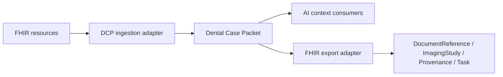

# Future FHIR Interoperability Design

Status: Draft  
Scope: Future mapping design, not implemented in v0.1

## Goal

FHIR interoperability should allow Dental Case Packets to exchange context with clinical systems while preserving the packet's AI-ready structure and non-diagnostic boundary.

The Dental Case Packet is not a replacement for FHIR. It is an AI context layer that can map to and from relevant FHIR resources where appropriate.

## Candidate FHIR Resources

| Packet Concept | Candidate FHIR Resource | Notes |
| --- | --- | --- |
| Patient demographics | `Patient` | Packet only stores minimal de-identified demographics. |
| Chief complaint | `Condition` or `Observation` | Use carefully; avoid implying diagnosis. |
| Clinical note | `DocumentReference` | Store source references and summaries. |
| Treatment plan text | `CarePlan` or `DocumentReference` | Must preserve clinician-authored status. |
| DICOM study | `ImagingStudy` | Best fit for CBCT and radiographs. |
| X-ray image reference | `Media`, `DocumentReference`, or `ImagingStudy` | Depends on source system. |
| Intraoral scan | `DocumentReference` or future dental profile | STL/PLY/OBJ lacks a perfect FHIR resource. |
| Photos | `Media` or `DocumentReference` | Privacy warnings required. |
| Packet manifest | `Provenance` and `DocumentReference` | Hashes and source references. |
| Review questions | `Task` | Future workflow integration. |

## Mapping Principles

- Do not map generated AI text as clinical truth.
- Preserve generated summaries as derived context.
- Preserve source provenance.
- Prefer references over embedded binaries.
- Mark packet outputs as non-diagnostic and for clinical review.
- Avoid creating FHIR `Condition` resources for AI-derived interpretations.

## Proposed Mapping Flow

## Open Questions

- Should dentistry-specific profiles be defined for intraoral scans?
- How should tooth numbering systems be represented?
- How should mixed FDI, Universal, and Palmer notation be normalized?
- Should packet review questions become FHIR `Task` resources?
- How should consent and purpose-of-use be represented?

## Future RFCs

- RFC: FHIR ImagingStudy mapping for CBCT.
- RFC: Dental scan artifact profile.
- RFC: Tooth notation normalization.
- RFC: Provenance and audit model.
- RFC: Consent and purpose-of-use metadata.

